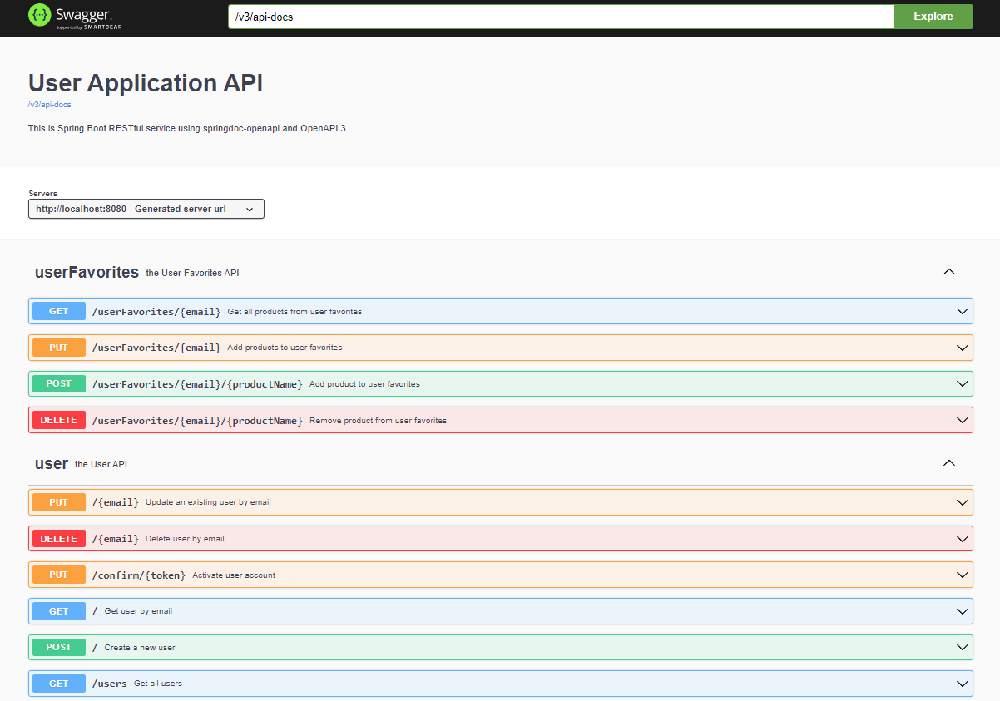

[](https://app.circleci.com/pipelines/github/SpringStoreOrg/com-boot-user-service?branch=main)   [](https://sonarcloud.io/summary/new_code?id=SpringStoreOrg_com-boot-user-service) [](https://github.com/SpringStoreOrg/com-boot-user-service/graphs/commit-activity)


# Spring Boot "User-Microservice" Project

This is a Java / Maven / Spring Boot (version 2.7.4) application.

## How to Run

This application is packaged as a war which has Tomcat 8 embedded. No Tomcat or JBoss installation is necessary. You run it using the ```java -jar``` command.

* Clone this repository
* Make sure you are using JDK 11 and Maven 3.x
* You can build the project and run the tests by running ```mvn clean package```
* Once successfully built, you can run the service using following method:
```
mvn spring-boot:run -Dspring.profiles.active=local
```
Once the application runs you should see something like this

```
2022-12-27 11:25:16.172  INFO [user-service,,] 21384 --- [main] o.s.b.w.embedded.tomcat.TomcatWebServer  : Tomcat started on port(s): 8080 (http) with context path ''
2022-12-27 11:25:16.279  INFO [user-service,,] 21384 --- [main] c.b.user.SpringUserServiceApplication    : Started SpringUserServiceApplication in 9.526 seconds (JVM running for 11.901)
```

## About the Service

The service is just a simple User REST service. For local environment it uses an relational database (MySQL) to store the data. If your database connection properties work, you can call some REST endpoints defined in ```com.boot.user.controller.UserController``` on **port 8080**. (see below)

You can use this sample service to understand the conventions and configurations that allow you to create a DB-backed RESTful service. Once you understand and get comfortable with the sample app you can add your own services following the same patterns as the sample service.

Here is what this little application demonstrates:

* Full integration with the latest **Spring** Framework: inversion of control, dependency injection, etc.
* Packaging as a single war with embedded container (tomcat 8): No need to install a container separately on the host just run using the ``java -jar`` command
* Writing a RESTful service using annotation: supports both and JSON request / response; simply use desired ``Accept`` header in your request
* Exception mapping from application exceptions to the right HTTP response with exception details in the body
* *Spring Data* Integration with JPA/Hibernate with just a few lines of configuration and familiar annotations.
* Automatic CRUD functionality against the data source using Spring *Repository* pattern
* Demonstrates MockMVC test framework with associated libraries
* All APIs are "self-documented" by Swagger3 / OpenApi 3 using annotations

For more info's we can invoke Swagger UI to explore our API.

[Swagger UI](http://localhost:8080/swagger-ui/index.html#/)

